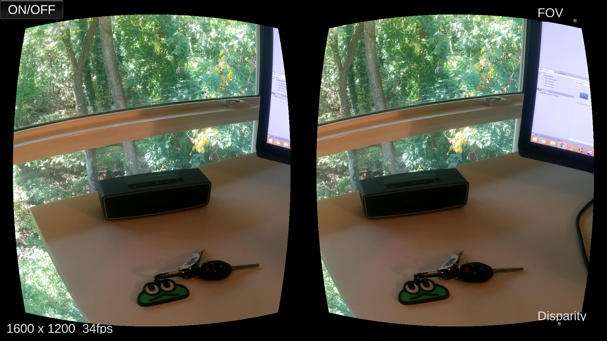
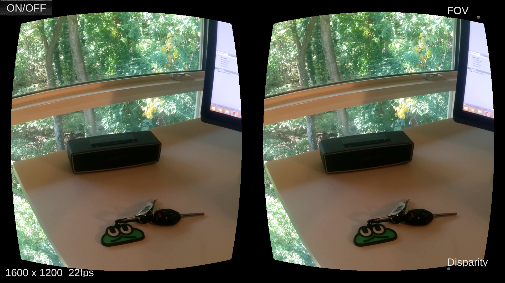

Cardboard See-Through
===
Author: Long Qian

Date: 2016-10-14

## Overview
The purpose of this repository is to turn Google Cardboard into an **Video See-Through (VST) Augmented Reality device**. However, there is usually only one camera for iOS and Android devices. The stereo vision is simulated by applying a fixed disparity to the left half and right half of the screen. [iPhone 7](http://www.apple.com/iphone-7/specs/) plus does have two cameras, but unfortuantely, they are not aligned vertically.

## Requirement
### Building
* Unity3D (v5.0+)
* Android SDK

### Running
* Android Phone (API 19+)
* **Google Cardboard v1**: Cardboard v2 is great, but it does not support camera capture. 

## Implementation
**Fragment shader** (pixel shader) of Unity3D does almost everything here, including:

* Apply correct pixel density adjustment to display image with correct scale
* [Barrel distortion](https://en.wikipedia.org/wiki/Distortion_(optics)) is done, so that the image is good for Cardboard lenses.
* Put disparity to the two halves of the display, so that a **FAKE** stereo vision is created.

The **FOV** and **disparity** level can be adjust through sliders on screen. **Frame rate** is displayed as well.

The pixel moving job is the last step of rendering. Augmented Reality application can run over this implementation, before the final texture is blited to the screen.

## Demonstration
The slider on the top right corner controls the field of view, which is correspondent to the size of visible area on the screen, and the slider on the button right corner controls the percentage of the difference in the image: 0.0 for exactly same display, and 0.1 for 10% difference.

## Conclusion
* **Shader** is your best friend.
* I am looking forward to stereo vision cameras on Android platforms.

